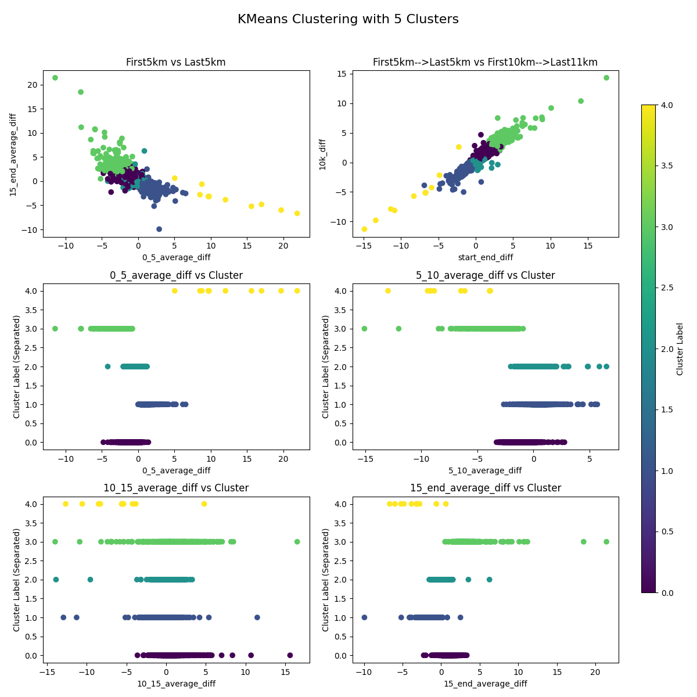
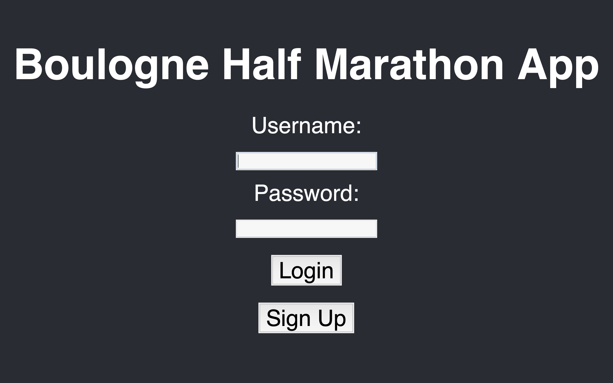
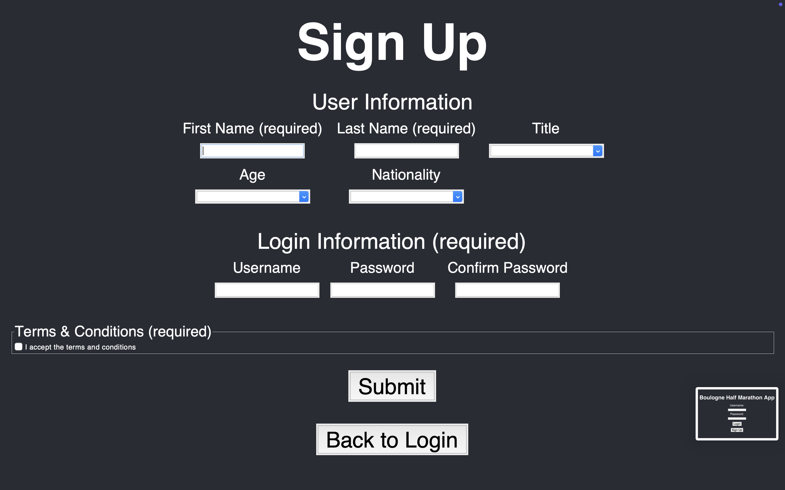
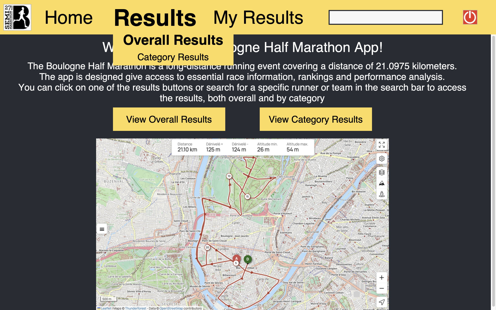
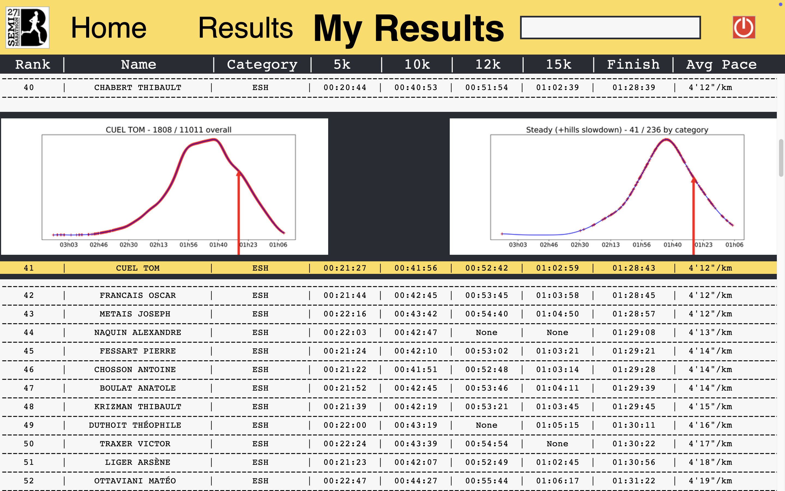

# Boulogne Half Marathon Analysis App in Python
> I’ve done an App in Python to show the different results linked to a Half Marathon I did back in November 2024 and from which I downloaded the results. This app is an upgraded version _(but also a different one)_ of the Ekiden App I previously did. The goal wasn't that much to just get used to Tkinter and the Python classes, but to add a runner race analyse, while still improving the functionnalities and the graphics for a better usage **(login, sign-up, buttons, search bar, …)**. Now everything relies on a **SQL database**, both datas _(that can still be loaded with the initial csv file)_ but also client informations with **crypted password** _(no app security but an additional feature)_. Datas are now handled through the **pandas and numpy libraries**, making it faster while handling **100x more datas**. It allows me to pre-process the datas to then implement some **Machine Learning tools**. I need to start using these techniques with Python tools, as they will be useful later. I used the **K-Means clustering algorithm** in this project to categorize each runner's performance.


#### Tables of contents
* [Path tree](#path-tree)
* [Direct links to folders](#direct-links-to-folders) 
* [Runners categorization](#runners-categorization)
* [Virtual Environnment and Librairies](#virtual-environnment-and-librairies)  
* [App preview](#app-preview)


## Path tree
```
Boulogne_Half_Marathon_Analysis/
├── Data/
│   ├── Databases/              
│   ├── Pictures/    
│   ├── Precomputed_graphs/    
│   └── Treatment file and temporary datas 
│
├── K_means_implementation/
│   └── Treatment files, datas and results
│
└── main functions             
```


## Direct links to folders 
* [Data](./Data/) : contains the files related to the treatment of the results 
    * [Databases](./Data/Databases/) : contains all the csv and SQL files used during the datas treatment and the app use
    * [Pictures](./Data/Pictures/) : contains some useful picture to show in the app and the README
    * [Precomputed_graphs](./Data/Precomputed_graphs/) : contains the precomputed generic picture for overall rankings as well as K-means results
* [Test K_means_implementation](./K_means_implementation/) : contains the files to try the Kmeans clustering method


## Virtual Environnment and Librairies
Since the libraries are not installed on my Mac, I need to set up a virtual environment to access and use the **required libraries**, here is how to do :

Creating the virtual environnment
```
python3 -m venv path/to/venv
```
Activating the virtual environnment
```
source path/to/venv/bin/activate
```
Downloading the librairies you need in the virtual environnment
```
python3 -m pip install what_you_need
```
To temporarly deactivate the virtual environnment
```
deactivate 
```
To suppress it
```
rm -rf path/to/venv
```

I used those librairies for this project : 
```py
import os # searching paths
import matplotlib.pyplot as plt # to plot things
import matplotlib.ticker as ticker # plots customization
import tkinter as tk # tkinter 
from tkinter import ttk # for more modern and and customizable widgets 
from tkinter import messagebox # for errors messages
from tkinter import PhotoImage # for pictures 
from PIL import Image, ImageTk # a better rezising
import re # regular expression
import bcrypt # password crypting 
import sqlite3 # SQL database 
import numpy as np # numpy arrays
import pandas as pd # dataframe use
from scipy.stats import gaussian_kde # gaussian modelisation
from sklearn.cluster import KMeans # for clustering purpose
from sklearn.preprocessing import StandardScaler # prepare the datas
```


## Runners categorization
#### Data pre-processing 
During the data pre-processing phase, I **computed various indicators**, such as pace intervals and differences between split times, to analyze the pace progression during the race. This step was essential for **identifying trends and patterns in the runners' performances**.

Additionally, I merged the M0-10H and M0-10F categories into two broader groups for both sexes to ensure that no category contained too few participants. This required **updating all category ranks** accordingly.

Below is a comparison between the original categories defined by the Fédération Française d'Athlétisme (FFA) and the new categories used for analysis:

| Old Category (FFA Labels) | New Category |
|---------------------------|--------------|
| JUH                       | JUH          |
| JUF                       | JUF          |
| ESH                       | ESH          |
| ESF                       | ESF          |
| SEH                       | SEH          |
| SEF                       | SEF          |
| M0-4H                     | MAH1         |
| M5-10H                    | MAH2         |
| M0-4F                     | MAF1         |
| M5-10F                    | MAF2         |

#### K-means clustering algorithm
To categorize runner performances, I applied the **K-Means clustering algorithm**, a widely used unsupervised machine learning technique. K-Means groups data points into a predefined number of clusters based on feature similarities.

###### How K-Means Works:
1. **Feature Selection**: for this project, key performance metrics such as pace progression, split differences, and final time were used as features.
2. **Cluster Initialization**: the algorithm randomly initializes `k` cluster centroids.
3. **Assignment Step**: aach runner is assigned to the closest centroid based on the Euclidean distance.
4. **Update Step**: the centroids are recalculated based on the mean of all assigned points.
5. **Iteration**: steps 3 and 4 repeat until the clusters stabilize or a stopping criterion is met.

###### Why K-Means?
- It provides a **data-driven** method to segment runners based on their performance trends.
- It helps identify distinct pacing strategies (e.g., **negative split, positive split, strong starter, consistent pace**).
- It is scalable and efficient for large datasets.

By leveraging K-Means, we can better **understand different running profiles and refine race analysis strategies**!

###### How I did it ? 
- Using **Scikit-Learn** Python library, for a more effictive approach
- **By hand** to know the whole algorithm without blindly applying the Python method
The by-hand method was a bit slower but the results are pretty similar. Still, the app results are used using the auto K-means clustering using Scikit-Learn.

###### Results analysis 
I then manually look at the data to identify the types of each runner group using my own running knowledge, as well as the race map _(since hills affect split times)_. Here are the results of a K-means clustering with five runner categories:



## App preview 
#### How to use it
Every button is clickable and will redirect you to the corresponding part of the App, you can use it like any app. For the login and the sign-up screens, the cursor is directly on the first entry, so we can type as soon as we wanted, and the tabulation and enter key does work here to move to the next entry to continue
Here is a preview of some screens you will encounter when lauching the app : 

#### Login screen render


#### Sign-up screen render


#### Home screen render


#### Own results screen render

